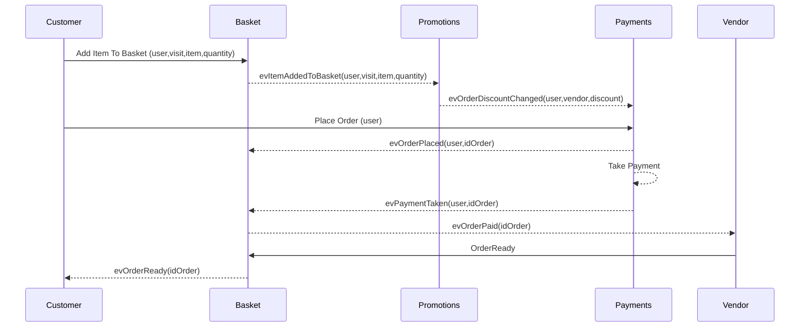
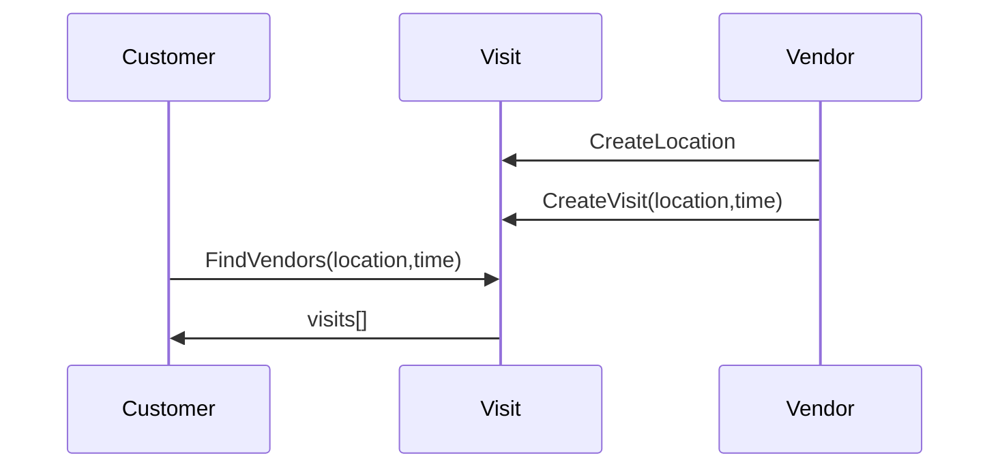

# Yeatery - Concept

## Opportunity

Mobile eateries and Street Food vendors are underserved by Deliveroo etc as they don't fit the **'delivery'** model.  These vendors include

* Mobile Sandwich Vendors
* Sporting Events Caterers
* Festival Caterers
* Weekly Market Stalls
* Seasonal Market Stalls
* Pop up Vendors
* Street Food Vendors

Typically, these food vendors are complementary to the main event (the football match, the gig) and compete with the main event for time.  Scheduled breaks in these events (half time, intermission between sets) only serve to increase the competition by compressing the opportunity into a 15 minute window to take an order, prepare it, cook it and serve it - in limited space with limited staff - to a queue of disgruntled customers.

The customer waits long queues (if they bother to queue at all), for rushed service and mediocre food, before rushing back to the main event.  The net result is dissatisfied customers (with chronic indigestion) and missed vendor opportunity.

What if Customers could place orders ahead of time - to be collected by them when ready or at an agreed place and time.  Distractions from the main event are kept to a minimum.   Better yet, what if they could do it well in advance such that the vendor could anticipate the demand and optimise their processes and staffing to maximize that demand with higher quality food.

Welcome to `Yeatery`

## Terminology

`venue` - a well known location such as Wembley Stadium.  It has an associated set of co-ordinates.

`location` - a place on a map which is not in the list of well known locations.  A vendor may visit this location.  Each vendor has a list of private locations.  A vendor can 'suggest' a location to be considered, by the Yeatery staff, as venue.  Examples would be the locations on the route of a sandwich vendor.

`event` - a future public event e.g. Glastonbury Festival at a location, at specific dates and times.  A vendor may visit this event.

`vendor-visit` - when a vendor will be, is, or was - at an event, location or venue - selling food.  A visit has an 'planned arrival time' and a 'planned duration'. 

`order-visit` - when a customer will be - at an event, location or venue - to have an experience (gig, sports event, festival).  Consuming food is part of this experience, but importantly, it is a distraction from the desired experience.

`vendor` - a vendor is a food-seller.

`menu` - a categorised view of order-items laid out in one or more categories (e.g. starters, mains, extras).

`order` - what the customer will, or has, ordered.  It is a collection of visits each with a collection of order-items

`order-item` - a selected item from the menu associated with the visit.  An order item may also identify the variant (small, medium, large or main/starter), the ingredients and the quantity, each of which may affect the price.

`collection-slot` - a visit duration is broken down into collection slots. For example a visit with a duration of 1 hour could be broken down into twelve 5-minute collection slots or six, 10-minute collection slots.  The number of collection slots and the duration of each is up to the vendor.

`collection-slot capacity` - a vendor has the capacity to process a finite number of order items in a collection slot depending.  This capacity depends on the item complexity, available staff, ability to pre-prepare and ability to store. Clearly not all order items require the same effort.

`effort` - the amount by which the collection slot capacity will be reduced in processing this order item.  Not all order items require the same effort to process for example picking a bottled drink could require an effort of 0, whilst preparing a pizza might have an effort of 2.  Each item on the menu has an effort.

## Vendor Experience.

### Onboarding

Vendors start by registering with minimal details (including the vendor name, email address and password) to begin the onboarding process.  

This allows the vendor to begin preparation to go live (create menus, menu items, pricing structures, promotions, visits and add employees), but they will not be visible in customer searches.  

At the same time, Yeatery staff complete the KYC and permit checks.  

When these checks are complete the vendor account is 'active' and any published visits will become visible in customer searches.

### Menu Items and Menus

Vendors begin with creating **menu items**.  A menu item can be *simple* with just a name, description and price or *complex* with variants (e.g. regular or large; starter or main), ingredients (e.g. toppings, bases etc), and sophisticated pricing.   

Menu Items also have an associated **effort** which is used - in combination with collection slots and capacity - to manage vendor workload. 

Vendors may also want to adapt the pricing - without changing the menu - to the event to reflect increased costs at the event.

Menu items are then arranged into **menus**.  Menus have categories (starters, mains etc).  The menus cannot be visually styled as we want to use the Yeatery look-and-feel across the site (to avoid confusion and emphasise the Yeatery brand).

### Promotions

A vendor (or Yeatery) may create one or more **promotions**.  Promotions are used to automatically calculate, and apply, a discount to a customer's order. 

### Visits and Collection Slots

Vendors then create one or more **visits** and associate a menu and a set of promotions with each visit.  Creating a visit begins with selecting where (event, venue or location) and when (date and arrival time), and for how long (number of collection slots, the capacity of each slot, and duration of each slot).

At this point, then vendor is ready to take orders.  

### Order Handling

Each individual order is associated with a collection slot so the vendor can see a pipeline of which orders need to be processed when.  The vendor may also look at the aggregate of all the orders in a visit (or indeed in past visits to predict future demand), their total value and the total discounts.  This allows supply management and pre-preparation to be optimised to increase throughput. 

The vendor can process each order through a number of stages from preparing, making, ready-for-collection and collected.  Orders ready-for-collection need to be stored such that collection can be efficient.  A customer reference - which is combination of collection slot and customer generated information - is attached to each order to allow easy storage and retrieval. 

### Accounts and Disbursement

Vendors can track the gross, discount, Yeatery and other fees (payment vendors), and net totals per visit.

Any undisputed amount will be disbursed weekly.

### Disputes

Vendors can also track any disputes.  These may arise because of card fraud, cold, missing or incorrect orders.  We would encourage the vendor to address cold, missing or incorrect orders at source if possible as their are fees associated with the dispute process.

## Customer Experience

### Onboarding

Customers are not required to register but may do so at any stage using email or via a social provider.   Email addresses will be confirmed.

The contents of a basket will be unaffected by registering unless a promotion is applied.

### Map Search

The search page is a map (which they can search, scroll and zoom within) and a time input (to allow the time window to be selected - time +- 30 minutes).

The centre of the map window shall be the search origin.  Visits shall be displayed at their locations within the map window boundaries.  Attempts to search with a wide zoom will cause the zoom to narrow and then trigger the search.  

Searches will be conducted within the time window which may span from one day to the next.  The search will return the vendors within the searched area - who will be visiting the venues, locations or events - at that future time

#### Search Result Display

Searches will return the 100 locations nearest the origin.   

These will be displayed as markers on the map.

#### Search Navigation

Each marker shall, 

* on hover - display the vendor name , and 
* on clicking - display the marketing blurb, promotions and capacity sparkline [^1]and an [[ order ]] button.

If the customer clicks the order button, they are taken to the vendors menu for this visit.

#### Search Caching

The results of the last search will be cached such that returning to the map will redisplay those results rather than making the customer search again.

> Google maps opens the website of the vendor in a separate page for ordering.  We could use a modal to achieve a similar effect or have the search at the top of the screen and the vendor selection at the bottom.

### Menu Browsing

Customers are presented with the menu of the selected vendor.  The menus, from any vendor, shall have a common look and feel.

Each item in the menu shall have a [[ add to basket ]] button.  Clicking this button shall add one item to the basket.

An item in the menu may have a [[ customise ]] button if the item is complex.  Clicking this button shall direct the customer to a customisation page for that menu item.

Customers can return to the map to select another vendor and repeat the process.  

### Basket

A basket summary will be displayed will just the total payable.  Clicking on the basket summary will navigate the customer to the detailed basket.,

The detailed basket contains a list of the visits (vendors, arrival and departure times).  

Each visit in the basket has contains the menu items ordered, the quantity and the item price.  Each visit also displays the subtotal of that visit and any discounts applied.  

The basket also displays the total, total discount and total payable for all the items in from all the visits.

### Checkout

Checkout begins with the customer arranging collection slots of their choosing (subject to collection-slot capacity limits) for each visit on the order.

The customer then makes the payment via card or wallet (apple pay or google pay).

Once the payment has been taken the order is placed.

### Order Progress and Collection

Customers will receive a 'ready-for-collection' alert for each collection slot on their order.

Customers may view other progress information by viewing their orders (if they have registered).

Only registered customers may cancel an order and only if fulfilment has not already begun (or is deemed to have begun)

# Architecture

## Background

### Architectural Requirements

Architecturally we want to design a system which is

* robust - by this we mean that changes to A do not effect B which in turn does not effect C.  This is a killer because it's virtually impossible to develop and test comprehensively.
* fault tolerant- what if X fails?  how do we detect it?  How do we recover from it?
* incremental - build in small isolated increments.

* extensible - we should be able to add features easily.  This is where events are beautiful as their publish-and-subscribe nature allows for bolt-on additions which reuse the same events without affecting the publisher.
* performant - as measure in terms of latency or throughput.
* scalable - if demand grows as we hope, we want to be able to scale by adding grunt or duplicating units rather than rewriting.

### Best Practices

* Microservices - building the system as a set of minimally coupled services.  The net effect of this approach is state of a 'thing' (e.g. a shopping basket) may be distributed over multiple services each of which has a concept of what the shopping basket means to them.  Creation and Deletion need to be originated in one of the services and the others follow it's lead.  The client side composes a view from multiple services.  If this is too slow then we can have a composition layer server-side.
* CQRS - command(write), query(read) responsibility separation.  Usually read requires 90% of resources and write 10%.  By separating them we can scale reads independently of writes.  The read side can also use different technology from the write side which better meets the query needs (e.g. a technology optimised for graph searches or an AI algorithm)
* Events - publish and subscribe as a means of decoupling.  Since the event publisher and subscriber may be on different machines with a network in between an event may get lost.  Mechanisms are needed detect loss, replay the event stream and ensure that duplicated events are not acted on again (idempotency).  **We also need to decide if events carry 'notifications' (you know there has been a change, but you don't know what),  'change' (X has changed, but you don't know how that has affected my state) or 'state' (here is a new version of my state)** 
* Eventual consistency - rather than atomic transactions (which cannot work across partitions) we accept that things will eventually be consistent.
* gRPC - this is a mechanism for making calls from one service to another.  The calls appear to be synchronous but are in fact asynchronous.  It implies tight coupling.  It also doesn't play well with Event Sourcing.  It is however the easiest way to move from a monolith a set of microservices.
* [Event Sourcing](https://martinfowler.com/articles/201701-event-driven.html) - this is different from pubsub in that we store and emit events but the write state is not stored.  Rather we run the events from the beginning of time until now (hence the event store) to recompute the write state.  The means that the individual events only ever store changes, not state.  This sounds bizarre however there are advantages, we can eliminate write database tables; it is an atomic operation; logs are automatic; hot swap is easy since write state is stored internally; read side can listen for events and create projections (an eventually consistent view of the current state).  We can create as many read side copies as needed.  The big downside for me is the need for a magical piece of infrastructure called the 'Event Store' which is very complex and distributed.  It's also seems to me that all the events in the system need to flow through the one 'Event Store'. 
* **guid**'s - globally unique identifiers should be used to identify entities and they may be allocated on the client.  The problem with database id's is that they infer the underlying concrete storage mechanism when the objective is to be independent of the underlying storage (document, sql, key-value).

### Challenges

Difficult to map onto some business processes without considerable duplication of data.

Event Communication - what if they never arrive? what if they arrive out of order (e.g. via a dependency A->B, A->C, B->C vs A->B, B->C, A->C? what if they arrive more than once?

Complex deployment - requires Docker/Kubernetes with a Load Balancer.  Upgrades are deploy new, redirect to new, retire old.  

Compositional clients - clients are the point at which the microservices converge.  What was previously one call is now N calls.

Requires some magic infrastructure (the Event Store).

Very 'chatty' both inter-microservices and between client and microservices.

It's difficult to map a business case onto the architecture and consequently its difficult to trace flow.

Potentially overkill.

## Strawman

The backend is composed of the following microservices.

| service     | role                                                         |
| ----------- | ------------------------------------------------------------ |
| Visit       | A vendor visits a location, on a date, for a duration.  A customer may search an area within a time window to see which vendors will be there.  A visit is further broken down into collection slots and each collection slot has a maximum capacity.  In this way demand can be evened out.    A unique set of promotions can also be set for each visit. |
| Vendor      | A vendor may register but certain checks (KYC, identity, permits etc) must be performed before a vendor account is 'live'.   Prior to going live, a vendor may create menus, create promotions, and plan visits but they will not show up in visit searches. |
| Menu        | A vendor may create one or more menus.  Each menu consists of orderable-items organised in a layout.   A menu must be associated with a visit but each visit can have a unique menu.  Customers can get the menu for the visit and use it to add orderable-items to the order. |
| Customer    | A customer may register with the service but are not required to do so to place an order.   Registering allows the customer to save their payment preferences, view current and past orders, and save their favourite vendors/items.  In the future a loyalty feature may be supported for customers. |
| Order       | A customer (or guest) may place an order for a number of orderable-items from multiple vendors.  An orderable-item has a pricing model (pricing could be complex),  may have variants (S,M,L) and/or ingredients (toppings, bases, sauces) which allow it to be tailored.  One payment is taken even if there are multiple vendors on the order.  A vendor may see the orders placed with them.   Only registered customers may cancel an order, in part or in whole, and only if fulfilment has not already begun (or is assumed to have begun) |
| Fulfil      | A vendor manage the fulfilment workflow of each order from in-preparation to ready-for-collection.  This workflow may need to be tailored. |
| Review (v+) | A customer may review visit which is associated with a vendor. |
| Promotions  | A vendor (or Yeatery) may create one or more promotions and assign them to a visit.  Promotions are used to calculate a discount for each vendor. |
|             |                                                              |

## Vendor

This is the vendor sign up process.  There will be some checks - both KYC related and for operating licences - but the result will be an entry in vendor store.

Each vendor has a unique identifier.

### Data

```typescript
interface IVendor {
    idVendor: guid;
    name: string;
    logo: string; // url('/assets/logo.png');
    tagline: string; // 'Perfect Pizza, Popular Prices'
}
```


### Commands


### Events


## Orderable Items

Vendors can have one or more orderable-items and an orderable-item can contain one or more other orderable items.  A vendor may create a new Menu to allow them to assign different pricing or different selection of items.

### Data

Data is shown as an interface but could be stored in whatever manner is deemed appropriate.

```typescript
interface IOrderableItem {
    idOrderItem: guid;
    title: string;
    price: number;
    ingredients: XXX // instructions which also affect the price.  Don't know how to model yet!
}
```

Orderable items can be grouped to form variants (e.g. regular/large or s/m/l or starter/main). 

```typescript
interface IOrderableItemGroup {
    idOrderableItemGroup: guid;
    title: string;
    items: guid[];
}
```

OrderableItems and OrderableItemGroups can be added to menus.

## Menus

### Data

```typescript
interface IMenu {
    idMenu: guid;
    title: string; // customer visible title for the menu e.g. 'Lunchtime Menu'
    notes: string; // vendor visible notes on the menu.  
}
```

```typescript
interface IMenuItem {
    idMenu: guid;
    idOrderableItem | idOrderableItemGroup: guid;
}
```


### Commands

| command                | parameters                                  | notes                                                        |
| ---------------------- | ------------------------------------------- | :----------------------------------------------------------- |
| createMenu             | {title}                                     | Something that allows you to quickly identify a menu when assigning it to a visit for example, "lunchtime menu, low season". |
| deleteMenu             | {idMenu}                                    | Delete the menu provided it is not in use.                   |
| findMenu               | {text}                                      | searches the title for the text.                             |
| addItemToMenu          | {title,description, variants:{title,price}} |                                                              |
| removeItemFromMenu     | {idItem}                                    |                                                              |
| associateMenuWithVisit | {idVisit,idMenu}                            | Allows a particular menu to be associated with a visit.  If a visit has orders, then we should reject this command. |


### Events Published

none - only because I think no one cares.

### Events Subscribed

evAddVisit - creates an entry such that the associate command can be validated.  If no visit exists then clearly it is an invalid association.

evDeleteVisit - removes the association with a menu.

## Visits

A vendor visits a location, on a date, at a time, and for a duration.  A unique menu can be associated with a visit (in this way items and pricing can be tailored to each visit if necessary).  A unique set of promotions can also be set for each visit.   To manage workload, we break each visit down into a number of collection slots, each of which has a maximum capacity (a dish on the menu can take up 0 or more capacity units depending on how complex it is to fulfil)

### Data

#### Visits

Visits are the key linking data-structure in the system.  When a visit is created the promotions and menu services listen.  A promotion and menu can then be associated with the visit.

| field     | type        | notes                                                        |
| --------- | ----------- | ------------------------------------------------------------ |
| idVisit   | guid        |                                                              |
| arrival   | datetime    | planned arrival time (using datetime as we may span days around midnight) |
| departure | datetime    | planned departure time                                       |
| location  | idLocation  |                                                              |
| recur?    |             | more complex that it might appear.                           |
| idVendor  | ref to guid | which vendor is this visit associated with.                  |
|           |             |                                                              |

### Commands

| command     | parameters                            | notes                                                        |
| ----------- | ------------------------------------- | :----------------------------------------------------------- |
| createVisit | {arrival,departure,location,idVendor} | The idVendor comes from the current session.                 |
| deleteVisit | {idVisit}                             | only possible if visit has no associated orders.  This begs the question of how the Visits service knows if a particular visit has orders.  The answer is that it subscribes to the evOrderPlaced event and keeps track. |
| findVisits  | {arrival,departure,location}          | List of Visits                                               |
|             |                                       |                                                              |
|             |                                       |                                                              |
|             |                                       |                                                              |

### Events

| command        | parameters                                     | notes |
| -------------- | ---------------------------------------------- | :---- |
| evVisitCreated | {idVisit, arrival,departure,location,idVendor} |       |
| evVisitDeleted | {idVisit}                                      |       |
| findVisits     | {arrival,departure,location}                   |       |
|                |                                                |       |
|                |                                                |       |
|                |                                                |       |

## Baskets

### Requirements

1. A user shall be able to add and remove items, from the menu of one or more vendors, to their basket.
2. A user shall be able to tailor an item as allowed by the menu (pick a size, select or deselect ingredients). 
3. A user shall be able to edit an item in the basket.
4. A user shall be able to change the quantity of an item in the basket without leaving the basket.
5. A user shall initiate the purchase with a [[ check out ]] button in the basket.
6. The price in the basket will update to reflect the items.
7. The discounts in the basket will update to reflect the items.
8. A user may perform these actions whether logged in or not.
9. Transitioning from a guest to an authenticated user (log in) shall leave the basket unaffected.  
10. Transitioning from an authenticated user to a guest (log out) shall empty the basket.
11. There is no requirement to synchronise baskets between devices.  If the same user is logged in on two different devices, each basket is independent.
12. A basket shall contain no sensitive information.
13. A basket may be held in client storage.
14. A basket shall empty after a defined period of inactivity even if logged in.


A Basket is an embryonic Order.  

When the client side initialises, it has some form of memory (local/session storage or cookie) of the current Order and it uses this to retrieve the current Order.  If their is no Order, then the Basket is empty.

When a user adds an item to the Basket, we need to create a new Order and add and Item to it.  The Basket will persist over reloads.  Consider what happens if we use a session cookie.  If the user closes the browser, then the cookie vanishes which means there is no Basket on the client and the server is left with a dangling order (which can be cleaned up in due course)

POST /basket {initial item} < setCookie(BASKET, idOrder).

POST /basket/items {item} < idItem

DEL /basket/items/:idItem

DEL /basket

POST /basket/checkout

GET /basket


What happens if a user can customise an item in the menu?  This process begins with them clicking [[ customise ]] beside a menu item.  This will create an item which could go in the basket.  We could assign it an guid, allow the user to edit it and then add it to the basket when they [[ save to basket ]] or delete it if the click [[ cancel ]].  If the item is in the basket, they see the same edit screen.  How do we navigate?  Looking at Domino's its /pizza/menu?id=xxx and then /basket/1.

A Basket contains a list of intended visits and items for each visit.  A basket is not an order.  A basket contains no sensitive information.  A basket is maintained on local storage.  When a user adds an item to a basket, it is updated in the local storage and then we call a service on the server to determine what discounts to apply.

Each device used establishes an independent basket.  The precludes the ability to edit a basket across multiple devices which is not envisaged as a likely use-case. 

A user may add to the basket anonymously or as an authenticated user.  Their is no correlation between a user and a basket.

The basket will only persist for a short period.  The user session may persist considerably longer.

This should provoke a client-side event which will force various client-side components to request information from the server.  One such entity is the BasketUI.  This will request an OrderSummary.   If the user had not put anything in the BasketUI prior to logging in, then the server simply returns an empty summary.  If the user had put something in the Basket (and therefore there is a cookie) then we use it to determine the summary.

If the user had nothing in the BasketUI (and therefore no cookie), then we should check to see if the user has any existing Orders with Items.  If so, we set the cookie to refer to this Order and return the summary associated with this Order.

A Basket, while seemingly simple, has a ton of functionality and state beyond the obvious items.    It keeps track of what Items the customer wants to purchase.  It is also the resource which orchestrates the placement of an order (reserve collection slots -> take payment -> place order) including error paths.  It also needs to interact with Promotions (which calculates discounts) and Menus (to get the pricing).  There is also the possibility of a Basket being for a guest or a logged-in user and the possible transaction from guest to logged-in user (where both may have an open basket).  We also have to consider a single user having multiple connections to Yeatery with a mix of guest and logged in sessions.  Does the basket have state which reflects whether a user is in the process of checking out (and at what stage in the process) with this basket...I think it does.  It may event need to hold information to allow actions to be undone although this feels like it should be distributed to the relevant microservice.

What is clear is than once logged in, their is a single basket shared between all sessions where the same person is logged in.

The same person may also visit the site without logging in and have multiple guest baskets. 

??? What does it mean to add an item to a basket.  ???  It has to be only the item, variant and ingredients.  The pricing needs to come from the server otherwise we are open to attack.  It's the same with discount calculation.  Domino's seems to do it by asking for the pricing for the Basket each time an item is added, removed or changed.  The basket is stored on the client. 

??? Is a Basket is created and destroyed or are they persistent ???

??? If created and destroyed, then when ???  

* We could create a basket when the user visits the site if no valid basket exists.  The idBasket could be stored in a cookie.   If a user subsequently logs in, we transfer the contents of this basket to their personal one.  **I have no idea where this functionality should be implement, nor how we trigger it.  The act of logging will be managed by a different microservice, which could emit an event with the guest idBasket of the guest, and then deletes from the session (remove cookie).  The Basket service could merge the users basket and the guest basket before deleting the guest basket.  This all feels monolithy rather then event-sourcey.  The fundamental tenet of ES is that the state is the summation of all events.  If I replay these events the guest basket could not be acted on.  I'm also reliant on cookies in the UI to work.**  I did consider allowing both to persist and the Basket UI to be the aggregate of both but this would not reflect into other sessions.`
* We could create a basket when the user adds their first item (and destroy it when they remove their last item).   This feels overly complex but may be necessary to avoid the unnecessary creation of a basket before log in.

OK, lets try and simplify the problem.  A Basket is a means of tracking what the customer wants to order.  It contains a number of {idVisit, idItem, quantity} records. Customers add and remove items regularly.  They can also change the quantity.

There are two Basket UI views.  A BasketSummary (price after discount, and items), and a BasketDetailsUI (visits with items, pricing and discounts).

The Basket UI needs to be populated with the vendor information (keyed by the visit), pricing information (keyed by the idVisit, idItem), and the promotion information (keyed by the idVisit, idItem).  

To get this information the client needs to query the server and build a composite view.  The vendor information comes from the vendor associated with the Visit. The pricing information comes from the current menu associated with the Visit.  The discount information could change each time an item is added or removed so it needs to be asked for each time. 

The Server may also remove items from the Basket if the visit is no longer in scope (passed the latest slot time).  The Basket UI needs to be updated to reflect this change.

Their is no need to be logged in to create a Basket but should a guest add items to a basket and then log in, the contents of the guest basket should be merged into their permanent basket.

#### Placing an order (checkout)

The act of placing an order follows a flow - reserve collection slots > make payment > place order.  The items remain in the Basket until the order is successfully placed.  The flow may fail at any point in the flow so actions taken may need to be reversed in some manner (by sending the anti-event?).   If the order does not complete with a certain time, the collection slots are released.  This flow is orchestrated on the server (can't be client because it could evaporate).  

It all starts with a [[ checkout ]] button on the Basket UI.  Clicking this could navigate us to a 'collection slot' screen which loads collection slots for each visit in the basket and their remaining capacity.  The capacity required for a visit is determined by the number of items in the basket (do all items contribute equally to the capacity e.g. making a burger vs picking up a drinks bottle)  A collection slot must be selected for each visit to progress.  This collection slot must be able to cope with all the capacity of the order (it may be possible for an order to span 2 collection slots to fulfil the order in which case collection will be in the 2nd collection slot)  It should also be possible to change these collection slots again before completing the order.  When a collection slot is selected to address the visit, the capacity is reserved on the server.

Having reserved collection slots we move to payment.  Payment is taken by some means, as yet to be determined, but could fail permanently.  Payment tends to be a 2 step process.  Step 1 we take the payment details and amount and get a token.  Step 2 is that the user confirms that they want to place the order and we use the token to actually take the order.

Once the payment phase is complete, we place the order and empty the basket.  We may also need to confirm collection slots.

The person may also just not finish placing the order or just take to long.

In all the failure e need to release the reserved capacity somehow. 

How do we allocate collection slots in the ordering flow.

### Vendor

How does a vendor see the world?

From a vendors perspective they need to see a pipeline orders by collection slot for each visit.  Each order has a list of items which need to be ready to be collected at a specific time.

Orders need to be picked one by one and fulfilled.  Many orders could be being fulfilled at the same time.  Each order follows a process flow to fulfilment which may need to be tailored to the business.  A starter flow could be in-prep > prepared > making >  fulfilled.  How the vendor organises their operations to manage this process not our concern. 


# Concept


### Location Service
- Vendors can create locations (places they will visit at some point in time).
- Vendors can create a Visit to location - at a date/time - for a duration.
- Vendors can start a Visit.
- Vendors can end a Visit.
- Customers can search for vendors - within a radius from an origin - currently or in a future time window.
- Customers see a list of vendors.  Promotions should be shown too.


### Order Service

- Customers can add Items, for a Visit, to a Basket.  Items can be from any Vendor who is visiting that location at that time.
- Customers can place Orders for the Items in their Basket.
- Customers can view their current Orders
- Baskets can have promotions which change their total price.
- Vendors are informed of new Orders after payment is taken.
- Vendors can set order limits.
- Vendors can mark an order 'being made'
- Vendors can mark an order and 'ready for collection'
- Vendors can cancel an order if they are unable to fulfil it.
- Customers can cancel an order, in whole or in part, if processing has not begun.
- Customers can determine how busy a Vendor.
- Basket expires if the Visit time expires.
- Customers can empty their Basket

### Menu Service
- Customers can view menus for a specific vendor, at a specific location, at a specific date/time.
- Vendors can create menus (fundamentally a title [lunch, dinner, vegan, kids, dessert etc], items and pricing).
- Vendor associates Menus with Visit (or default Menus).

### Promotions Service

- Vendors can create a Promotion.
- Promotions apply discounts to Orders.
- Promotions can be applied to all items (10% off), some items (10% of main courses), N for 1 (buy 1 get 1 one free), N cheapest (by 2 get cheapest free), Multibuy (3 for price of 2).
- Promotions are limited by date (valid between), by time (happy hour), by user (one code per user) or by location (at Ulster Rugby). 
- Promotions can be linked to marketing campaigns.
- Customers placing orders may be prompted to take advantage of an offer (buy one more and get 50% off)

### Notification Service

Notifies customers that their orders are ready for collection once the vendor has arrived at the Visit. Text, Email or In-App.

### Customer AAA Service

### Vendor AAA Service

### Review Service

- Customers can review a Vendor.

### Event (a gig) Service

- Event Organisers can create an Event.
- Vendors can be at an Event


## 100,000 ft Architecture

The 'server' is a collection of microservices who collectively realize the service.  

The services should, insofar as is possible, be independent and unaware of each other.

Events are published by a service in response to some internal change.  Events reflect changes which have already taken place.  The publisher is unaware of who, if anyone, has subscribed to receive the events. 

Subscribers may listen for events without knowledge of who the publisher was.

A client is a veneer over an API to the server which can construct composite views from information received from one or more microservices.

Clients also send commands to one or more microservice.  

As this is an event centric domain (and therefore architecture) the 'U' (for update) in CRUD should be avoided as it conveys no domain meaning.  

> Which is better, updateAccount(data) or creditAccountWith(amount).  Whilst it increases the API surface, it results in clearer event flow.

A single customer (or vendor) can be logged in to multiple clients simultaneously.  

A customer (or vendor) client is a React App (probably Next or Gatsby).

Baskets are stored on the server such that they are available on, and can be edited on, any platform.  Their is no need for change in the Basket to be live.

> As an aside, could Mojo also be an event driven system rather than a form driven system? cmdCreateApplication, cmdSetLoanAmount, cmdAddApplicantToApplication, evApplicationCreated,  evMortgage evApplicantAddedToApplication.    This would result in a massively wide API.  It's also likely that the MortgageApplication service would be the destination of these commands and publisher of the events.  The events could be listened too by the MortgageApplicationSummary service which could emit the evSummaryChanged.  The customer client could request the latest offers for the service using a command.  The service which handles this needs the Summary and the Offers in order to do the 'find' operation.  The Summary lives in one service and the Offers in another. 
>
> 1. We could make the Client fetch the Summary and then call the Offers service.  The Offers service then runs the search.  This feels long winded.
> 2. We could have the client call the Offers service and the Offers service call the Summary service (or vice versa) with a command but this creates coupling.  Perhaps this is acceptable. 
> 3. We could have the Summary live within the Offers service but this feels wrong.  
>
>  The vendor client could request the mortgages which match a particular offer.  To satisfy this request we need to use the offers criteria to search the summaries.
>
> 1. We could have the client call the Offers service and then call the Summary.  The Summary service runs the search.  This feels long winded.
> 2. We could have the Offers service directly call the Summary service and the Summary service runs the search.
> 3. We could have the Summary live within the Offers service but this feels wrong.  
>
> Despite the reservations about option 1 it is architecturally the cleanest and avoids RPC calls internally at the expense of a more chatty API.  Microsoft has an article on this where they (as an option) propose the insertion of an API gateway where this aggregation is done.  In effect, that's what I am doing in the REST component (which reaches out to individual controllers to construct satisfy the request).
>
> This leads to other interesting scenarios where JOINs could be performed on the client.  Consider the Vendor Domain service which returns a list of {idDomain, fullName, svr}.  When a client requests the offers for a particular mortgage we get the summary and then use than to request the offers from the Offers service.  The Offers service does a JOIN with the domains service to inject the {idDomain, fullName, svr} into each offer (with considerable duplication) such that the client side can compute the per offer {repayments}.   Rather than do a server side JOIN we could do it on the client side.

## Flows

### order placement



### Find Vendors

Two pieces of information are needed to conduct a search - a time window and a search area.  

Searches will be conducted within the time window which may span from one day to the next but is limited to a max of one hour.  The limit of 1 hour is to avoid search results with multiple visits for the same vendor at the same location.  The implication is that a vendor may not schedule a visit to a location within 1 hour of a previous visit.

The centre of the map window shall be the search origin.    Visits shall be displayed at their locations within the map window boundaries.  This shall only happen at an appropriate zoom level.  Searches will return the 100 nearest locations. 

'clustered markers' may be used for where multiple vendors are at the same approximate location.  The 'clustered markers' will explode out as the customer zooms in.

Each marker (non clustered) shall, on hover - display the vendor name , and on clicking - display the marketing blurb, promotions and capacity sparkline [^1]

#### Services

| Service    | Request           | Reply                                                      |
| ---------- | ----------------- | ---------------------------------------------------------- |
| Visit      | {location,time}   | List of {idVisit}                                          |
| Workload   | List of {idVisit} | Map of {idVisit, collection slots : {time, used-capacity}} |
| Promotions | List of {idVisit} | Map of {idVisit, promotion summaries}                      |
| Vendors    | List of {idVisit} | Map of {vendor, name, logo, tagline, food types}           |

#### Composite View

```
Date: Friday 12th June 2021

Vendor: [[Pat's Pizza]] 
Description: Perfect Pizza, Popular Prices
Promotions:{name,discount,conditions}[]
Busy: [sparkline]

Vendor: [[Bob's Burgers]]
Description: Big Burgers, Brilliant Prices
Busy: [sparkline]

Vendor: [[Ian's Indian]]
Description: Iconic Indian Idiyappam
Busy: [sparkline]
```


### View Vendor

When a user selects a vendor they are actually selecting a visit.  Since they could be just browsing so we just show them the menu and promotions specific to that visit however we want to make it easy to order quickly hence the [[add to basket]] button.  The datetime from the search is passed to the vendor via the URL.

```
Vendor: Pat's Pizza
Date: Friday 12th June 2021
Busy: [sparkline]
Menu Items: {category,name,price,description,<size?>,[[add to basket]],[[customize?]]}[]
Promotions:{name,discount,conditions}[]
```

#### Services

| Service    | Request                 | Reply                                           |
| ---------- | ----------------------- | ----------------------------------------------- |
| Vendor     | {idVisit}               | {name, logo, tagline, food types}               |
| Workload   | {idVisit}               | {collection slots : {time, used-capacity}}      |
| Promotions | {idVisit }&view=details | {promotion details}                             |
| Menus      | {idVisit}               | List of {category,name,price,description,sizes} |

### View Basket

A basket is a list of Visits (one per Vendor) and each Visit has a list of Items.  This means that we can add/remove Vendors from the Basket and add/remove Items from a Vendor in the Basket.

#### Summary

This resides at the top right of the screen and is persistent and navigable.  It is generated on the server and pushed to the client (pulling may be used)

```
[[ItemCount!]]
```

#### Details

This is rendered when a user clicks on the Summary

```
Vendor: [[Pat's Pizza]] [[Delete]]
Items: {name,itemPrice,<quantity>, totalPrice,[[delete]]}[]
Vendor Total: £20.00! (saved £2.00!)

Vendor: [[Bob's Burgers]] [[Delete]]
Items: {name,itemPrice,<quantity>, totalPrice,[[delete]]}[]
Vendor Total: £10.00!

Vendor: [[Ian's Indian]] [[Delete]]
Items: {name,itemPrice,<quantity>, totalPrice,[[delete]]}[]
Vendor Total: £10.00!

Price: £40.00 (saved £2.00) 

[[Place Order]] 
```

> The Basket lives on the server so any client side changes must be sent to the server.  Eventual Consistency means that pricing and discounts are not updated immediately on the server and therefore need to be projected 'live' to the client. 

| Service    | Request | Reply                             |
| ---------- | ------- | --------------------------------- |
| Basket     | {}      | List of {visit, items[]}          |
| Promotions | {}      | List of {visit, discount}         |
| Vendor     | visit   | {name, logo, tagline, food types} |

### Customise Item (future)

A MenuItem may be customizable.  One extreme are Pizza's which have many potential ingredients (just look at Dominos).  Most festival food vendors don't have complex requirements. 

```
Vendor: Pat's Pizza
Date: Friday 12th June 2021 @ 9:45pm
Items {category,name,price!,description,<size?><ingredients>,[[add to basket]],[[cancel]]}[]
```

### Review and Place Order

Once the user has pressed [[place order]] they are directed to a payment flow.  The 1st stage in this flow is to pick collection slots for each vendor.  It is not possible to have single collection slot as the capacity is a characteristic unique to each vendor.

#### Collection Slots (modal)

A list of selectable {collection slots, used capacity}.  Some may be disabled if the % is at 100.

```
<[[9:00pm:70%]]> [[9:05pm:60%]] [[9:10pm:70%]] [[9:15pm:98%]] [[9:20pm:80%]] [[9:25pm:40%]] [[9:30pm:100%]]
```

> In reserving a collection slot, we reserve the required capacity from the vendor.  

#### Payment

Standard payment methods are accepted.  Payment cannot be cash-on-delivery as this would slow the collection process.

### Customer Reference

 The order id is the ultimate truth but it is cumbersome.  Something like 'three little words' is easier to remember or a QR code or just the last 4 digits of the order code which would narrow it down considerably?  Also helps the vendor manage storage and retrieval of items.  

The customer could enter JoeB but their may be a clash.  Using the three little words approach we could use Indigo-439-JoeB where we represent collection slots with a colour (in one hour we have max of 12 collection slots), 439 is a random number and JoeB is the ref they entered.

### View Orders

```
Order ID: 12345-11212
Customer Reference: Indigo-273-GaryH

Vendor: Pat's Pizza 
Collection: Friday 12th June 2021 @ 9:35pm
Status!: Being Made
Items: {name}[]
Vendor Total: £20.00 (saved £2.00)

Vendor: Bob's Burgers [[Cancel]]
Collection: Friday 12th June 2021 @ 9:45pm
Status!: Not Started
Items: {name}[]
Vendor Total: £10.00

Vendor: Ian's Indian [[Cancel(disabled)]]
Collection: Friday 12th June 2021 @ 8:45pm
Status!: Ready-For-Collection
Items: {name}[]
Vendor Total: £10.00

Total Price:
Total Discount?:

[[Cancel Order?]] 
```


### Collect





## Data

### Vendor


### Locations

Locations are named places and a point on a map (given as {latitude,longitude}).

| field       | type                                    | notes                          |
| ----------- | --------------------------------------- | ------------------------------ |
| idLocation  | guid                                    |                                |
| point       | {lat, long}                             |                                |
| name        | string (a vendor name for the location) |                                |
| owner       | idVendor                                |                                |
| isWellKnown | boolean                                 | certain venues are well-known. |
| marker      | jsonb                                   | {colour, style}                |

### Visits

Visits are the key linking data-structure in the system.  When a visit is created the promotions and menu services listen.  A promotion and menu can then be associated with the visit.

| field      | type       | notes                                     |
| ---------- | ---------- | ----------------------------------------- |
| idVisit    | guid       |                                           |
| arrival    | datetime   | planned arrival time                      |
| departure  | datetime   | planned departure time                    |
| location   | idLocation |                                           |
| recur?     |            | more complex that it might appear.        |
| menu       | guid       | the menu associated with this visit       |
| promotions | guid       | the promotions associated with this visit |

### Orders

| field       | type   | notes                                                        |
| ----------- | ------ | ------------------------------------------------------------ |
| idOrder     | guid   |                                                              |
| placedBy    | guid   | the user who placed the order.                               |
| visit       | guid   | ref to the visit which contains the vendor,location and time. |
| status      | enum   | open, making, ready, received.                               |
| customerRef | string | Something which allows user to confirm that the order is theirs. |

### Order Items

This is complicated by orders having many potential options.  Consider Pizza's where we can have different sizes, bases, sauces, crusts and toppings.  There may be a max number of toppings. The pricing is also complex in it the price of the Pizza - and any bases, sauces, crusts and toppings - may vary by size. Additionally toppings may be free, extra or individually priced. There are also dietary and allergy considerations.  

It may be that the only way to handle such complexity is by having dedicated menu item types (which map to classes) and data as it's just too complex to model in a DB table (or set of tables).  I don't think we loose anything by not being able to search.

| field       | type   | notes                                                        |
| ----------- | ------ | ------------------------------------------------------------ |
| idOrderItem | guid   |                                                              |
| name        | string | The name from the menu                                       |
| type        | enum   | Simple, Pizza                                                |
| ingredients | json   | JSON of the choices made e.g. size (S,M,L or XL), sauce (), hold the X. |
| quantity    | number |                                                              |

### Workload Management

A mechanism is needed for managing the workload of a vendor.  Conventionally this manifests itself as long queues or delivery times.  Each vendor can handle a certain capacity in terms of items in a 5 minute slot.  

Capacity is a function of the business but is typically dependent on production process (pre-prep vs just-in-time), staff numbers and organisation, and storage/collection capacity.  A McDonalds approach is optimized for high throughput (thin burgers, fast cooking, bun warmers).  

> An artisan approach to food would lead to low capacity but potentially higher prices.  Some items don't store well after production so just-in-time preparation may be more appropriate.  If demand could be anticipated, then more optimised production can be developed leading to increased capacity. 

## Micropatterns

**guids are used everywhere and can be created by the client.**  

**events are mean to be fire-and-forget i.e. no coupling.**  Events are also 'past tense'.  The event source should not know who wants the event or why.  If not, then we have coupling.

**data duplication is OK.** Each service may maintain a copy of some data.  It need not be all the data sent in an event and it may puts it's own spin on it or store it in a manner most efficient for its operation.  Because data is duplicated, this infers a coupling of sorts.  If service B is listening for events from service A, it is aware of some details of the domain (keys and payload are on the event API) of service A.  It's OK to have bi-directional coupling (smaller the better) just make sure it's not indicative of bad partitioning 

**Orchestration and Choreography should be be avoided if possible.**   Orchestration brings with it the problems of rollback should something go wrong. Choreography (chained events where the originator listens for an eventual 'end event') brings with it the problems of detecting and recovering (rollback?) from broken chains where the error may be far into the chain.

**event PubSub should be used for decoupling**.  To compensate for a failure or delay event producers need to periodically publish a special 'sync event' with the last id published such that consumers can detect a failure.  On detecting a failure a consumer can re-request publication, the consumer issues a evReplay (a system event) with the service and lastId.  The producer listens for these events and replays as requested.  Consumers must ignore events already received.  This mechanism could also be used to bring services online in an already running system.

**A commandId should be used to associate events (or a chain of events) with the originating command.**

**An event stack should be used if one event leads directly to the creation of another.**  This can be used to debug on failure just like a call stack.

**Individual services are responsible for ensuring consistency if they require it.**  Consider the payments service.  If an item is added (or removed) from the order the payments service will see an event (to add or remove the item) with a requestId.  It also then should also receive an event from the promotions service with the same requestId with an updated discount.  As part of the validation of a 'pay' request, it needs to ensure that all expected events have been received. 

**State, as viewed from the UI, is a composition of the state held by different services.** The state could be composed on the client by making multiple requested, or composed in the server API layer (graphql?). 

**Prefer services with state and event journal to be embedded within the microservice**.  `CQRS/Event Sourcing/Event Store` pushes us to a model were the write-side builds an aggregate from the Event Store.  This is used to validate the request and if accepted, we write a new event to the Event Store.  This new event is used on the read-side to construct a `projection`. The problem is that the Event Store, whilst conceptually simple, is a very complex piece of new technology which combines the attributes of a distributed database and a pubsub system capable of replays and queryable. 

## Initialization

### Full - power on

### Partial - one (or more services) coming online in a running system

### Watchdog

### Service Discovery

## Scaling and Resilience

The idea behind microservices is that they are the unit of scaling and resilience.  Multiple copies of a service run, each with their own data.  Should one fail, another can restart to take it's place.  As demand increases, more service copies can be brought online.

This is great in principle but is implies that data can be sharded.

There are 3 ways to scale.

1. Grunt  - bigger processor, more memory, more/faster disks.

2. Decomposition - break into horizontal layer each with dedicated grunt, break into smaller micro-services which co-operate.

3. Sharding - break into vertical workers each of which works on a slice of data.  

   

### Sharding

Sharding is complex in that it requires 

* An API gateway in front of the service which will route the request to the an instance of the microservice.  It could be that any instance will do, or it could be it needs to go to a specific instance.
* Underlying data which is unique to that instance of the service.  It may be possible to shard the data by geography, by key, by price, by name - basically any non-overlapping set which can fulfil the request.
* Sharing tables increase coupling but may be impossible to avoid.  Replication may come into play (one writer, multiple readers).

Consider the visit search.  The visit data is a set of {location, time, vendor}.  Find is based on {location,time} and returns vendor[].  If we shard by location then searching on geographic boundaries becomes impossible as the request is only routed to one server.  If we shard by time and route based on time to the correct instance, then we can distribute the load and the data. However, if we need to search based on {location,vendor} to return time[] then this is difficult as we need to issue the request to multiple servers and co-ordinate the replies.

## SEO

What SEO requirements are there? 

* Vendors should be exposed with marketing blurb.

* Visits should be exposed merged with vendors, promotions and menus.

## Service Interfaces

The challenge here is to make 3 interfaces work co-operatively in the pseudo-single thread of a Node engine.  Each microservice has it's own http server, websocket server and event server.  An external client will only access the http and websocket servers.  A client will establish a unique websocket connection to each microservice that supports it.

### HTTP (fastify)

HTTP is stateless in that each request is opened, processed and closed.  Session details must be embedded in every request and authentication verified each time.

When a user initiates a request to the http server, the session is extracted and if authentication, the request is processed and a reply given.  This is a pseudo async interface in that a request must always end with a reply but the intervening processing may 'await' calls to blocking code rather than block.

### Event PubSub (redis)

Redis should be OK in that we register a callback with redisClient.On('what', cb). 

### Websockets (outgoing only).

A websocket interface is stateful in that once opened, it can be used to send information to and from the client.  The client or the server may initiate a close at any time.  We also need to re-establish the connection should it be dropped.

When a user logs in, a websocket connection is established by the client.  Multiple connections from multiple clients by a single user may be established simultaneously (they may have forgotten to log out or may be using a web and mobile application).  

As part of the websocket connection protocol a *wsServer.on('request', cb*) callback is invoked.  The callback is passed a request with session details which can be used to authenticate, extract the idUser (or idSession) and accept the request.  This establishes a bi-direction connection from one client to the server.

The  idUser is then held in a Map to allow us to correlate 1 user (or session) with N websocket connections.  Each time something of interest happens for that user, we broadcast to all connections for that user.

The server uses this connection to publish events of interest to the client.  The server will self-register for these events and publish them to the websocket interface whether or not the connection is established.  The websocket server will route them to the 

??? Should a websocket connection be established on log on or when on a relevant page.  Different connections may be established at different times for instance a notification connection may establish on log on and a price connection on page load.

??? How to route only relevant events to the correct websocket connection.  For example, the orders service probably only wants to map changes to orders with the idOrder of interest to the websockets associated with the user.  How to do this mapping?  Need to register for the event.  When it is received evOrderPlaced(idOrder) we need to look up the id of the user who owns the order and then call the websockets wrapper with send({idUser, eventType, payload})

## Dictionary
[^1]: a tiny bar graph showing how busy the vendor is in all collection slots.
[^2]: effort required to make a menu item.  Part of the mechanism to manage workload.

