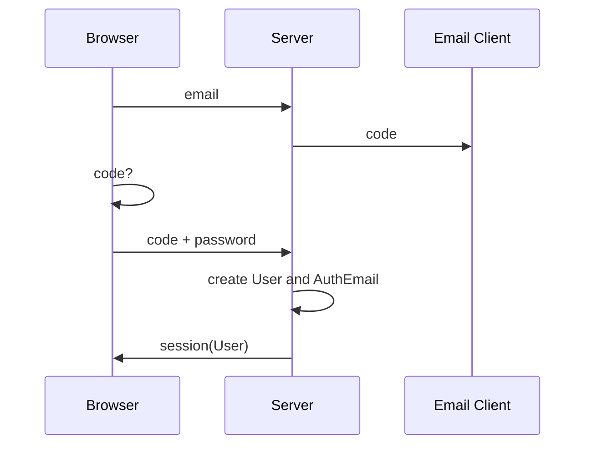

# Overview
An email address can be used a form of unique identity.  To essential to verify that the user owns the email address by sending some form of confirmation email to the account.  An email can only be associated with one User even in multi-tenant applications.

All of the critical use cases assume that the user has access to the email account.  If a malicious user gains access to the email account, there is no way to prevent them from performing an action.

The email may be used to signin with or without a password (commonly called passwordless).     

Passwordless operation has the benefit of not requiring the user to remember multiple passwords.  

## Requirements
### Self Registration with password
The user shall be prompted to enter their email.  

If the email is not used, the system shall send registration email with a time-limited code (or link with token).   If the email is already associated with an account a notification email should be sent instead.  

The user shall then be prompted to enter the code (or link with token) along with a password.  

The system shall confirm the code (or token) is valid and create a User and associated AuthEmail and a session shall be issued. 

### Self Registration without password
The user shall be prompted to enter their email.  

If the email is not used, the system shall send registration email with a time-limited code (or link with token).   If the email is already associated with an account a notification email should be sent instead. 

The user shall then be prompted to enter the code (or link with token).  

The system shall confirm the code (or token) is valid and create a User and associated AuthEmail and a session shall be issued. 

### Admin Registration without password
An admin shall be able to register a new user with a valid email.   The User record and an associated AuthEmail record will be created (without a password).  Only passwordless signin is possible until the user sets a password.

### Set, Reset or Change a password
The user shall be prompted for an email.  A time-limited code (or token) shall be sent to that email.  If the email does not exist, the request will be silently discarded.

The user shall then be prompted to enter the code (or click the link) and enter a password.  The password for this AuthEmail shall be changed and a new session will be issued for the User associated with the AuthEmail.

### Passwordless Signin
The user is prompted for their email.  A link is then sent to this email.  On clicking that link a new session is established.

### Password Signin
The user is prompted for their email and password.  If they match those stored by the system, a session is established.


### Multi-factor Signin
The user is prompted for their email.  The system contacts an external app seeking confirmation of the signin request for this email (and possibly with device info).  The user confirms that the signin is legitimate.  

> This flow is very asynchronous.  There may be delays from the user responding, they may respond too late.  Liveview (an websockets in general) seem like a good application for this this flow.


## Data

```typescript
interface AuthEmail {
	email: string // primary and unique
	salted_hash: string // a combined salt and hash

	user_id: string // the id of the associated user
}
```

## Self Registration (by link)



## Self Registration (by code)


## API

## Links
If a link is issued, it must point to a client side page.  If it points to a server side page, then the server must redirect back to a client side page.

